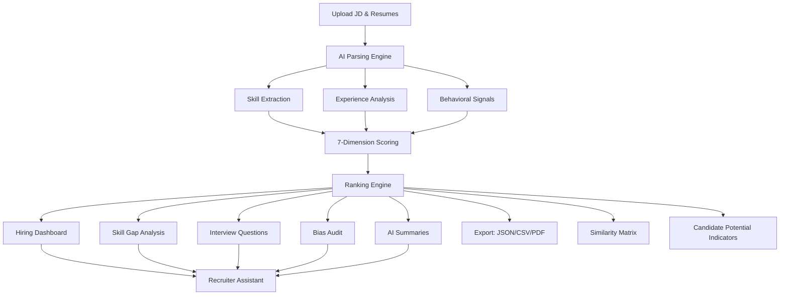

# AI-Powered Candidate Ranking System

An independently developed recruitment-support application that compares candidate resumes with a job description, calculates explainable fit scores, and presents ranked results for recruiter review.

I developed the application code, interface, scoring workflow, and project-specific modules independently. The project uses the open-source libraries and pre-trained embedding model listed below, with their names included for technical attribution.

---

## Core Features

### Main Functions

| Feature | Description |
|---------|-------------|
| **Semantic Matching** | Sentence-BERT embeddings compare text beyond exact word matches |
| **Integrated Analysis Modules** | Parsing, scoring, skill-gap analysis, reporting, and recruiter assistance |
| **Bias Audit** | Identifies and masks selected personal indicators for a separate audit report |
| **Explainable Rankings** | Every candidate gets a human-readable reason for their rank |
| **Recruiter Assistant** | Natural-language questions about the current candidate results |
| **Candidate Potential Indicators** | Heuristic indicators based on profile information |
| **PDF Report Generation** | One-click professional recruitment reports ready for stakeholders |
| **Candidate Similarity Matrix** | Visual skill overlap grid showing duplicate/unique profiles |
| **Batch Operations** | Multi-select candidates for bulk shortlisting, export, or comparison |

### Additional Interface and Reporting Features

- **🚀 Candidate Potential Indicators** — Profile-based indicators to support recruiter review
- **📄 PDF Recruitment Report** — Complete styled report with Ctrl+S/print-to-PDF
- **🔗 Candidate Similarity Matrix** — Skill overlap percentage grid
- **📊 Hiring Dashboard KPIs** — Average, median, std deviation, pool strength
- **✅ Batch Operations** — Select all, multi-shortlist, bulk export
- **🔧 Weights Configurator Bug Fix** — No more duplicate initialization
- **🎯 Filter System Rewrite** — Now uses actual data, not DOM parsing
- **📈 Candidate Details** — Skill counts, career-path indicators, and learning recommendations

### User Interface

- **Glassmorphism Design** — Premium frosted-glass aesthetic with micro-interactions
- **Skeleton Loading** — Smooth shimmer loading states during analysis
- **Animated Elements** — Particle background, hover effects, and count-up statistics
- **Dark/Light Theme** — Persistent theme toggle with smooth transitions
- **Responsive Design** — Full mobile, tablet, and desktop support
- **Keyboard Shortcuts** — Power-user shortcuts: `Ctrl+Enter` analyze, `Ctrl+1-6` tabs, `Esc` close, `/` search
- **Bulk Actions Bar** — Dynamic toolbar appears when candidates are selected
- **KPI Cards** — Animated hiring dashboard metrics

### 📊 Advanced Analytics Dashboard

| Visualization | Description |
|--------------|-------------|
| **Score Distribution** | Bar/doughnut toggle chart showing candidate score tiers |
| **Skill Coverage** | Horizontal bar chart of skill distribution across candidates |
| **Experience Distribution** | Doughnut chart showing experience levels |
| **Potential Scores** | Dual bar chart comparing fit score vs potential score |
| **Skills Word Cloud** | Visual frequency representation of all candidate skills |
| **Custom Scoring Weights** | Interactive sliders to adjust scoring dimensions in real-time |
| **Skill Gap Analysis** | Per-candidate and aggregate missing skills visualization |
| **Hiring KPIs** | Mean, median, std dev, pool strength recommendation |

### ⭐ Candidate Shortlisting System

- **Star Shortlisting** — ⭐ buttons on each candidate row to add/remove from shortlist
- **Persistent Storage** — Shortlist saved to `localStorage` across sessions
- **Dedicated Shortlist Tab** — View all shortlisted candidates in one place
- **Shortlist Export** — Export shortlisted candidates as JSON
- **Shortlist Counter** — Live counter in navigation bar

### 🔍 Advanced Filtering & Sorting

- **Name Search** — Filter candidates by name
- **Score Range Filter** — Excellent (80%+), Good (60-80%), Moderate (40-60%), Low (<40%)
- **Experience Level Filter** — Senior (7+), Mid (3-6), Junior (1-2), Entry (<1)
- **Shortlist Filter** — All, Shortlisted Only, Not Shortlisted
- **Column Sorting** — Click any column header to sort ascending/descending
- **Search Input** — Quick search across all candidates

---

## 🚀 Quick Start

### Prerequisites
- Python 3.8+
- pip (Python package manager)

### 1. Install Dependencies
```bash
cd candidate-ranking-system
pip install -r requirements.txt
```

### 2. Start the Server
```bash
python app.py
```

The server starts at `http://localhost:5000`

### 3. Open the Dashboard
Open your browser and navigate to **http://localhost:5000**

### 4. Try with Sample Data
Click the **"🎯 Try with Sample Data"** button to run analysis on built-in sample resumes with 1 click.

### 5. Upload Your Own Data
1. Upload a job description (PDF, DOCX, TXT) or paste JD text
2. Upload candidate resumes (multiple PDF/DOCX/TXT files)
3. Click **"🚀 Analyze & Rank Candidates"**

---

## 💻 User Workflow



---

## ⌨️ Keyboard Shortcuts

| Shortcut | Action |
|----------|--------|
| `Ctrl` + `Enter` | Run analysis |
| `Ctrl` + `1`-`6` | Switch tabs (Upload/Rankings/Shortlist/Analytics/Assistant/Bias) |
| `Ctrl` + `Shift` + `T` | Toggle dark/light theme |
| `Esc` | Close any open modal |
| `/` | Focus search input |

## 📡 API Endpoints (14 Routes)

| Method | Endpoint | Description |
|--------|----------|-------------|
| `GET` | `/api/health` | Health check + model status |
| `POST` | `/api/analyze` | Upload JD + resumes for full analysis |
| `POST` | `/api/analyze-sample` | Run analysis on built-in sample data |
| `POST` | `/api/copilot` | Submit a recruiter-assistant query about candidates |
| `POST` | `/api/copilot/clear` | Clear recruiter-assistant chat history |
| `POST` | `/api/compare` | Compare two candidates side-by-side |
| `GET` | `/api/analytics` | Get recruitment analytics summary |
| `GET` | `/api/skill-gaps/<index>` | Get skill gaps for a candidate |
| `GET` | `/api/interview-questions/<index>` | Get interview questions |
| `GET` | `/api/potential/<index>` | Get candidate potential score |
| `GET` | `/api/bias-report/<index>` | Get bias-audit report |
| `GET` | `/api/candidate-summary/<index>` | Get AI candidate summary |
| `GET` | `/api/export` | Export results as JSON/CSV |
| `GET` | `/api/download` | Download ranked candidates CSV |

---

## 🛠️ Technology Stack

| Layer | Technology |
|-------|------------|
| **Backend** | Python 3, Flask, Flask-CORS |
| **ML/NLP** | Pre-trained Sentence-BERT model (`all-MiniLM-L6-v2`), sentence-transformers |
| **File Parsing** | PyPDF2, python-docx, pdfplumber |
| **Data Processing** | Pandas, NumPy, scikit-learn |
| **Frontend** | HTML5, CSS3 (Glassmorphism), Vanilla JavaScript ES6 |
| **Charts** | Chart.js 4.4 (bar, radar, doughnut) |
| **Typography** | Inter (Google Fonts), Font Awesome 6.5 |
| **Storage** | LocalStorage (shortlist, theme) |

---

## System Capabilities

The application supports semantic comparison, configurable weighted scoring, candidate ranking with explanations, skill-gap analysis, interview-question generation, analytics, shortlisting, candidate comparison, and result exports. It is a decision-support tool; recruiters remain responsible for reviewing results and making hiring decisions.

---

## 📁 Project Structure

```
candidate-ranking-system/
├── app.py                      # Main Flask application (14 API routes + caching)
├── requirements.txt            # Python dependencies
├── test_backend.py             # Backend verification script
├── TASK_PLAN.md                # Enhancement roadmap
├── README.md                   # This file
├── models/
│   ├── __init__.py             # Module exports
│   ├── embedding_model.py      # Sentence-BERT embedding engine
│   ├── parser.py               # JD and resume parsing with behavioral signals
│   ├── scorer.py               # Hybrid 7-dimensional scorer
│   ├── ranking_engine.py       # Core ranking with CSV export
│   ├── skill_gap_analyzer.py   # Skill gaps + candidate potential engine
│   ├── interview_generator.py  # Tailored interview question generator
│   ├── bias_evaluator.py       # Bias audit and text anonymization
│   └── copilot.py              # Natural-language recruiter assistant module
├── frontend/
│   ├── index.html              # Main dashboard UI (6 tabs + modals)
│   ├── script.js               # Complete frontend logic v4.0 (1713 lines)
│   └── style.css               # Premium glassmorphism styles v3.0 (2038 lines)
├── data/
│   ├── jobs/                   # Sample job descriptions
│   ├── resumes/                # Sample candidate resumes
│   ├── outputs/                # Generated CSV/JSON outputs
│   └── uploads/                # User uploaded files
├── scripts/
│   ├── rank_candidates.py      # CLI ranking script
├── reports/                    # Generated reports
└── docs/                       # Documentation
```

---

## 🔧 How the AI Engine Works

### 1. Document Parsing (NLP)
- **Skills Extraction**: 200+ technical skills across 11 categories
- **Behavioral Signals**: Leadership, impact, publications, presentations
- **Experience Parsing**: Years of experience with regex patterns
- **Education Classification**: PhD → High School level detection

### 2. Semantic Embedding
- **Model**: all-MiniLM-L6-v2 (384-dim embeddings, 80MB)
- **Purpose**: Understands meaning, not just keyword matching
- **Fallback**: TF-IDF vectorization if the Sentence-Transformer model cannot be loaded

### 3. 7-Dimensional Scoring
| Dimension | Weight | What It Measures |
|-----------|--------|-----------------|
| Skill Match | 35% | Keyword + semantic matching with partial credit |
| Experience | 20% | Sigmoid-curve fair scoring |
| Project Relevance | 15% | Semantic relevance + depth bonus |
| Semantic Similarity | 15% | Sentence-BERT deep understanding |
| Education | 5% | Degree level matching |
| Certifications | 5% | Certification relevance |
| Behavioral | 5% | Leadership, impact, publications |

Profile completeness is also calculated and returned as a separate metric; it is not included in the final weighted score.

### 4. Enrichment Layer
- **Skill Gap Analysis**: Missing required/preferred skills with learning recs
- **Candidate Potential**: Heuristic indicators based on profile details
- **Interview Questions**: 8 categories of tailored questions with difficulty levels
- **Bias Audit**: Fairness scoring and anonymization metrics
- **AI Summaries**: Recruiter-ready candidate overviews

---

## Recruiter Assistant Examples

Ask natural language questions like:
- *"Show top 5 candidates"*
- *"Candidates with Python and AWS skills"*
- *"Who lacks Kubernetes experience?"*
- *"Compare Sneha and Karan"*
- *"Tell me about Divya"*
- *"Which candidates best match this role, and why?"*
- *"What's the average candidate score?"*
- *"What skills are most common?"*
- *"Show me a summary of all candidates"*

---

## Bias Audit and Anonymization

The application creates a separate bias-audit report using text masking for detected names, email addresses, phone numbers, addresses, gender pronouns, age indicators, and photo-related terms. The audit is performed after candidate ranking; the current implementation does not rerun the ranking on anonymized resume text. Therefore, this feature does not guarantee that rankings are free from bias.

Masking depends on text patterns and may not detect every personal indicator or indirect source of bias. Recruiters should review the report and evaluate the system for fairness before relying on it in a hiring process.

---

## Operational Notes

| Item | Details |
|------|---------|
| **Embedding Model** | `all-MiniLM-L6-v2` (384-dimensional embeddings) |
| **Supported Files** | PDF, DOCX, and TXT |
| **Maximum Upload** | 50 MB total, configured in the Flask application |
| **Analysis Time** | Depends on hardware, model initialization, file size, and candidate count |

---

## Dependencies and Attribution

The application and project-specific logic are independently developed. The third-party packages and pre-trained model listed in the technology stack and `requirements.txt` are used as dependencies and are not claimed as original work.

# Candidate-Ranking-System

